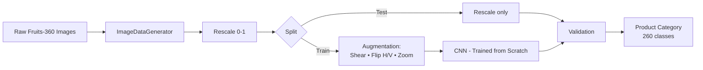

<div align="center">


<br/>

<a href="https://github.com/Mohanad234128/Retail-Product-Recognition-System-Computer-Vision-ITI/stargazers"></a>
<a href="https://github.com/Mohanad234128/Retail-Product-Recognition-System-Computer-Vision-ITI/network/members"></a>
<a href="https://github.com/Mohanad234128/Retail-Product-Recognition-System-Computer-Vision-ITI/issues"></a>


<br/><br/>


</div>

<br/>

## 🛒 Overview

Manual product recognition in retail and warehouse environments is **slow, error-prone, and impossible to scale**. This project builds a **Convolutional Neural Network from scratch** that looks at a single product image and predicts its category — the kind of building block that powers automated checkout, sorting, and inventory-tracking pipelines.

As a representative retail product domain, the system is trained and validated on the **Fruits‑360** dataset — **260 product categories**, **182,945 images**, captured from multiple rotation angles against a consistent background.

<div align="center">

</div>

## 📚 Table of Contents

- [Overview](#-overview)
- [Dataset](#-dataset)
- [Pipeline](#-pipeline)
- [Model Architecture](#-model-architecture)
- [Training Configuration](#-training-configuration)
- [Results](#-results)
- [Key Insights](#-key-insights)
- [Project Structure](#-project-structure)
- [Getting Started](#-getting-started)
- [Roadmap](#-roadmap)
- [Tech Stack](#-tech-stack)
- [Team](#-team)
- [Contributing](#-contributing)
- [Contact](#-contact)

<br/>

## 📦 Dataset

<div align="center">

| Attribute | Value |
|---|---|
| **Source** | [Kaggle — Fruits‑360](https://www.kaggle.com/datasets/moltean/fruits) (`moltean/fruits`) |
| **Categories** | 260 fruits, vegetables & nuts |
| **Training images** | 137,221 |
| **Test images** | 45,724 |
| **Image size** | 100 × 100 px, RGB |
| **Capture style** | Multiple rotation angles per physical sample, uniform background & lighting |

</div>

<br/>

## 🔄 Pipeline



Images are streamed straight from the folder structure with Keras' `ImageDataGenerator`. Pixel values are rescaled to `[0, 1]`, and the **training set only** is augmented (shear, horizontal flip, vertical flip, zoom) to improve generalization — the test set is rescaled only, keeping evaluation unbiased.

<br/>

## 🧠 Model Architecture

A CNN built **from scratch** with the Keras Sequential API — no pretrained backbone, every filter learned from raw pixels up.

<div align="center">

| Layer | Output Shape | Parameters |
|---|---|---|
| Conv2D (128 filters, 3×3) | (98, 98, 128) | 3,584 |
| MaxPooling2D | (49, 49, 128) | 0 |
| Conv2D (64 filters, 3×3) | (47, 47, 64) | 73,792 |
| Conv2D (32 filters, 3×3) | (45, 45, 32) | 18,464 |
| MaxPooling2D | (22, 22, 32) | 0 |
| Dropout (0.5) | (22, 22, 32) | 0 |
| Flatten | (15,488) | 0 |
| Dense (5000, ReLU) | (5000) | 77,445,000 |
| Dense (1000, ReLU) | (1000) | 5,001,000 |
| Dense (260, Softmax) | (260) | 260,260 |

**Total trainable parameters: 82,802,100**

</div>

<br/>

## ⚙️ Training Configuration

<div align="center">

| Setting | Value |
|---|---|
| Optimizer | SGD (Stochastic Gradient Descent) |
| Loss function | Categorical Crossentropy |
| Batch size | 64 |
| Callback | `EarlyStopping` (monitor: val_accuracy, patience: 5) |
| Environment | Local machine — Windows, **CPU-based** training |

</div>

<br/>

## 📊 Results

The model was trained for **5 epochs** before the run was stopped, with both train and validation metrics climbing steadily and no sign of divergence — the model was still learning productively.

<div align="center">

| Epoch | Train Acc | Train Loss | Val Acc | Val Loss |
|:---:|:---:|:---:|:---:|:---:|
| 1 | 58.64% | 1.3412 | 79.57% | 0.8660 |
| 2 | 80.45% | 0.6135 | 87.13% | 0.7119 |
| 3 | 88.08% | 0.3669 | 91.12% | 0.6364 |
| 4 | 91.34% | 0.2549 | 91.16% | 0.6113 |
| **5** | **93.38%** | **0.1859** | **94.18%** | **0.5340** |

### 🏆 Final Validation Accuracy: `94.18%` · Final Validation Loss: `0.534`

</div>

<br/>

## 💡 Key Insights

- A **from-scratch CNN** reached **94.18% validation accuracy across 260 classes in only 5 epochs** — strong evidence the architecture and augmentation strategy fit the task well.
- Training and validation curves were still rising with no plateau, meaning **more epochs would likely push accuracy even higher**.
- Compared to transfer learning (e.g., **MobileNetV2** pretrained on ImageNet), a from-scratch CNN needs more epochs and compute since it learns low-level visual features from zero instead of reusing features from a much larger corpus.

**Recommended next steps:**

- 🔁 Continue training beyond 5 epochs — the model hadn't plateaued
- 🧪 Evaluate on an independently sourced, held-out test set for real-world generalization
- 📈 Run a per-class confusion matrix / precision–recall breakdown to spot visually similar categories the model confuses
- 🪶 Explore MobileNetV2 transfer learning as a lighter, faster-converging alternative
- ⚡ Move training to GPU to cut training time substantially

<br/>

## 🗂 Project Structure

```
Retail-Product-Recognition-System-Computer-Vision-ITI/
├── Docs/            # Written report & documentation
├── NoteBook/         # Jupyter notebook(s) — data prep, model, training
├── Presentation/     # Project presentation slides
├── requirements.txt  # Python dependencies
└── README.md
```

<br/>

## 🚀 Getting Started

```bash
# 1. Clone the repository
git clone https://github.com/Mohanad234128/Retail-Product-Recognition-System-Computer-Vision-ITI.git
cd Retail-Product-Recognition-System-Computer-Vision-ITI

# 2. Install dependencies
pip install -r requirements.txt

# 3. Download the Fruits-360 dataset from Kaggle
#    https://www.kaggle.com/datasets/moltean/fruits

# 4. Open the notebook and run it end-to-end
jupyter notebook NoteBook/
```

<br/>

## 🗺 Roadmap

- [x] Data pipeline with augmentation
- [x] From-scratch CNN architecture
- [x] Baseline training & evaluation (5 epochs)
- [ ] Extended training to convergence
- [ ] Per-class confusion matrix analysis
- [ ] MobileNetV2 transfer-learning comparison
- [ ] GPU-accelerated training run
- [ ] Deployment-ready inference script / API

<br/>

## 🧰 Tech Stack

<div align="center">


</div>

<br/>

## 👥 Team

<div align="center">

| Name | GitHub |
|---|---|
| Yasser Mogahed | [@Yasser-Mogahed](https://github.com/Yasser-Mogahed) |
| Abdallah Ali | [@abdallah-farahat](https://github.com/abdallah-farahat) |
| Mohanad Ibrahim | [@Mohanad234128](https://github.com/Mohanad234128) |
| Faisal Abdulaziz | [@Wttcss](https://github.com/Wttcss) |
| Marawan Mohamed | — |

</div>

<br/>

## 🤝 Contributing

Contributions, issues, and feature requests are welcome! Feel free to check the [issues page](https://github.com/Mohanad234128/Retail-Product-Recognition-System-Computer-Vision-ITI/issues) or open a pull request.

1. Fork the project
2. Create your feature branch (`git checkout -b feature/amazing-feature`)
3. Commit your changes (`git commit -m 'Add amazing feature'`)
4. Push to the branch (`git push origin feature/amazing-feature`)
5. Open a Pull Request

<br/>

## 📬 Contact

<div align="center">

Built as part of the **ITI Computer Vision** track.


<br/>

⭐ **If this project helped you, consider giving it a star!** ⭐


</div>
